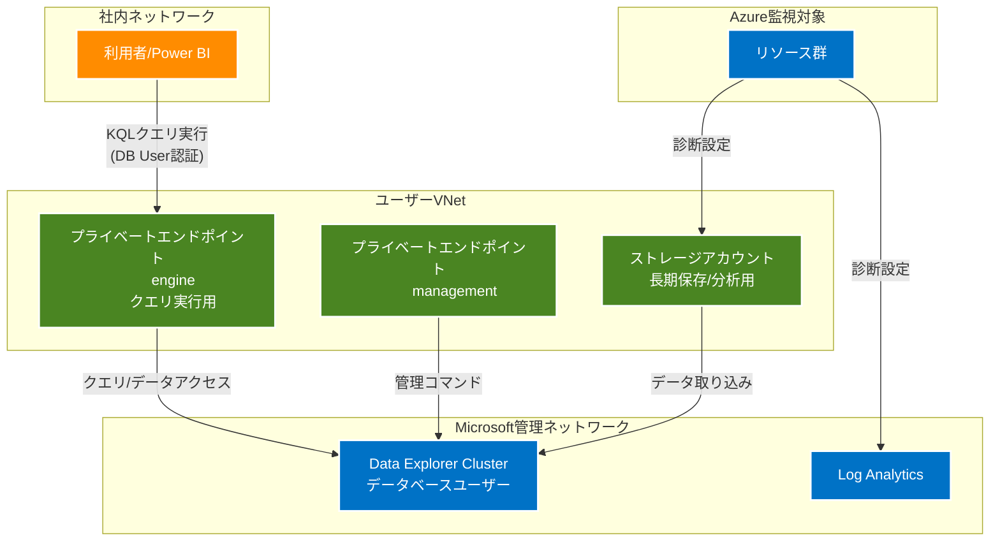

# Azure Data Explorer ログ分析基盤 導入検討まとめ

## 1. 構成図



## 2. 主要コンポーネントと役割

### Azure Data Explorer
- ログデータの長期保存と高速分析
- KQLによるクエリ実行
- データベースユーザーによるアクセス制御

### ストレージアカウント
- 診断ログの長期保存
- Data Explorerへのデータ取り込み用
- 業務用ストレージとは分離して管理

### プライベートエンドポイント
1. engineエンドポイント
   - クエリ実行用
   - Power BIからのデータアクセス
   - データの読み書き操作

2. managementエンドポイント
   - ADX管理コマンド用
   - テーブル管理
   - ポリシー設定

## 3. ログ保持期間設定

```
セキュリティ監査ログ: 1年以上
- Azureへのログインアクセス
- 特定リソースへのログイン

アプリケーションログ
- Info: 数日
- Error/Warn: 1年（比較検証用）

インフラログ
- キャパシティプラン分析用途に応じて設定
```

## 4. データ取り込み設定

### 診断設定
```
リソース → 診断設定
↓
1. Log Analytics (リアルタイム監視用)
2. ストレージアカウント (長期保存/分析用)
```

### Data Explorer取り込み
- ストレージからバッチ取り込み
- 頻度は用途に応じて設定（15分～数時間）

## 5. アクセス制御設定

### データベースユーザー設定
```kql
// ユーザー作成
.add database LogAnalytics users ('powerbi@contoso.com') 'PowerBIUser'

// 権限付与
.add database LogAnalytics viewers ('PowerBIUser')
```

## 6. ネットワーク要件

### プライベートエンドポイント
- VNet内に配置
- DNS設定要
- NSGでのアクセス制御

### 必要なDNSゾーン
```
- privatelink.{region}.kusto.windows.net
- privatelink.{region}.kustoworker.windows.net
- privatelink.blob.core.windows.net（ストレージ用）
```

## 7. セットアップ手順

1. Data Explorerクラスター作成
   - 基本設定（Dev/Test推奨）
   - プライベートエンドポイント設定

2. ストレージアカウント設定
   - 診断ログ用の専用ストレージ
   - プライベートエンドポイント設定

3. データベース作成
   - 保持期間設定
   - テーブル定義

4. アクセス制御設定
   - データベースユーザー作成
   - 権限設定

5. データ取り込み設定
   - 診断設定の構成
   - 取り込みスケジュール設定

## 8. 運用上の注意点

1. モニタリング
   - データ取り込み状況
   - クエリパフォーマンス
   - ストレージ使用量

2. コスト管理
   - ログレベルに応じた保持期間設定
   - 必要なデータのみ取り込み
   - クラスターサイズの最適化

3. セキュリティ
   - プライベートエンドポイントの管理
   - アクセス権限の定期レビュー
   - 監査ログの確認

## 9. 次のステップ

1. 小規模環境での検証
   - 基本機能の確認
   - パフォーマンステスト
   - アクセス制御テスト

2. 監視ダッシュボード作成
   - Power BIテンプレート作成
   - 必要なクエリの準備
   - アラート設定

3. 本番環境への展開
   - スケールアップ計画
   - バックアップ戦略
   - 運用手順の確立